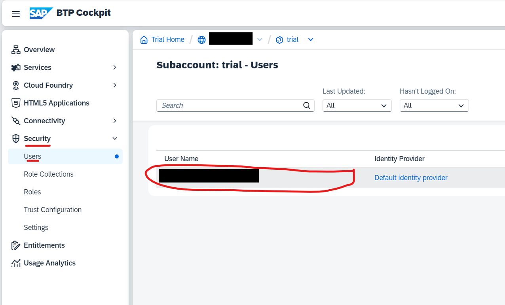

# Running the Hardware Store

In this lab, you will install and run a small hardware shop built using the SAP Business Technology Platform (SAP BTP). By the end of this exercise, you should have the system running on SAP BTP and a basic understanding of how it operates.


This hardware shop will be used throughout the lecture as a basis for additional exercises.


## Prerequisites

Before you begin, ensure you have the following:

- A laptop or desktop computer with internet access
- An email address and a phone number
- Basic knowledge of the terminal
- Basic knowledge of Git, Node.js, and SAP BTP

## Deploying the Hardware Shop on SAP BTP

We'll use the [SAP Business Application Studio](https://www.sap.com/products/technology-platform/business-application-studio.html)  for deployment. You can also deploy from your computer, but using SAP Business Application Studio is recommended as it simplifies the process.

### Step 1: Set Up SAP BTP Trial Account

1. Follow [this tutorial](https://developers.sap.com/tutorials/hcp-create-trial-account.html) to create a trial account for SAP BTP.

### Step 2: Set Up SAP Business Application Studio

1. When creating the development workspace in the 4th step of the following tutorial, name the workspace `Hardware_Store`. 
2. Follow [this tutorial (only Step 4 needed)](https://developers.sap.com/tutorials/set-up-bas.html#:~:text=STEP%204-,Launch%20SAP%20Business%20Application%20Studio,-Navigate%20to%20your) to subscribe to the SAP Business Application Studio in your trial account. Remember to name the workspace `Hardware_Store`.

### Step 3: Clone the Project and Install Dependencies

#### Pre-Requirement, if you clone a repo from github.com

Before you can clone a github.com GitHub repository into your SAP Business Technology Platform (BTP) environment, you need to create a **Personal Access Token (PAT)** on GitHub. This token will be used for authentication instead of your password. To get this token:


1. Go to **github.com GitHub** and log into your account: 
[https://github.com/](https://github.com/)
2. In the top-right corner, click on your **profile picture** and select **Settings**.


3. In the left sidebar, select **Developer settings**.


4. Click on **Personal access tokens > Tokens (classic)**. 


5. Click on **Generate new token (classic)**. 


6. Provide a descriptive **name** for the token, e.g., `BTP Git Clone Token`.

7. Under **Expiration**, select a validity period for the token (e.g., 30 days or custom).

8. In the **Select scopes** section, choose:
   - `repo` – Full control of private repositories. 


9. Scroll down and click **Generate token**.

10. **Copy** the generated token and **store it securely**. You won't be able to view it again. 


#### Continue here if you are on a public GitHub Repo or already have a token for github.com


1. Open the development workspace `Hardware_Store` you created in the previous step.
2. Open a new terminal by clicking on the three lines at the top left of the development environment, then selecting **Terminal > New Terminal**. 

 
 
3. In the terminal, enter:
   ```bash
   git clone https://github.com/WebThor/btp_security.git
   ```
4. Open the newly created directory in the development environment by clicking on the three lines at the top left, selecting **File > Open Folder...**, choosing the `btp_security` folder, and clicking OK. Trust the directory if prompted and open the terminal again, if it is now closed. 
5. You should now see the folder structure on the left side of your development environment. 
Here's an overview of the project structure:

```plaintext
/btp_security
├── approuter/                     # Application Router
│   ├── resources/                 # Static Resources
│   │   └── images/                # Images Folder
│   │       ├── HT-1000.jpg
│   │       ├── HT-1010.jpg
│   │       └── HT-1030.jpg
│   ├── xs-app.json                # Approuter Configuration
│   ├── package.json               # Approuter Dependencies
│   └── package-lock.json          # Approuter Lockfile
├── backend/                       # Backend Application
│   ├── lib/                       # Business Logic
│   │   ├── repository.js          # Handles Product CRUD Operations
│   │   └── products.json          # Product Data
│   ├── static/                    # Static Frontend Files
│   │   └── index.html             # Frontend UI
│   ├── index.js                   # Backend Server Code
│   ├── package.json               # Backend Dependencies
│   └── package-lock.json          # Backend Lockfile
├── security/                      # Security Configuration
│   └── xs-security.json           # XSUAA Configuration
├── images/                        # Images for Git Repository (not needed for the app)
├── tasks/                         # Tasks folder containing the tasks for this Lab
├── manifest.yml                   # Project Deployment Descriptor
├── package-lock.json              # Root Lockfile
└── README.md                      # Project Documentation
```
6. Go to the terminal and ensure you are in the `btp_security` folder. Navigate to it via the terminal if necessary.

 


### Step 4: Set Up Cloud Foundry

1. In the `btp_security` folder in the terminal, run:
   ```bash
   cf login -a https://api.cf.us10-001.hana.ondemand.com
   ```
   - Enter the email address you registered with SAP BTP.
   - Enter the password you use to sign in to your SAP account.

   The output should look like this:

```bash
   
 Authenticating...
OK

Targeted org XXXtrial.

Targeted space dev.

API endpoint:   https://api.cf.us10-001.hana.ondemand.com
API version:    3.180.0
user:           <your email address>
org:            XXXtrial
space:          dev
   ```

### Step 5: Deploy the XSUAA Service

The XSUAA Service ensures that you can log in to the hardware store and get authenticated by SAP BTP.

1. In the `btp_security` directory, run:
   ```bash
   cf create-service xsuaa application xsuaa-service-tutorial -c ./security/xs-security.json
   ```
   This creates an XSUAA instance named "xsuaa-service-tutorial" using the configuration stored in the `./security/xs-security.json` file.

2. Check the service status by running:
   ```bash
   cf service xsuaa-service-tutorial
   ```
   Wait until you see `status = "create succeeded"`.

### Step 6: Assign Necessary Roles


In this step, we will assign the required roles to your user so that you have the right permissions to run and interact with the hardware store application.

**What are Roles?**
Roles in SAP BTP specify what actions a user can perform within the platform. By assigning specific roles, you give users the permissions they need to interact with applications and services securely.

Here’s how to assign roles to your user:

**Step-by-Step Guide:**

1. **Log into SAP BTP Cockpit**
   - Open a web browser and go to the [SAP BTP Cockpit](https://cockpit.hanatrial.ondemand.com/).
   - Log in using the credentials you used to sign up for the SAP BTP trial.
   

2. **Navigate to the Subaccount**
   - Once logged in, you will see your global account. Click on your **trial subaccount**.
   

3. **Go to the Security Section and assign the JediOrder Role Collections**
   - In the left-hand navigation pane, click on **Security** to expand the menu options. Then, select **Users**. 
   - Select your user   
 
   - On the right-hand side a window opens, in the **Role Collections** table, select **Assign Role Collection**

   - Search for **JediOrder**  

   - Assign this role collections to your BTP User. In the future, you have now the Scope of the JediOrder for any BTP Application you connect with the deployed XSUAA service (in our case the XSUAA service called xsuaa-service-tutorial)
 

   
4. **Verify Role Assignment**
   - After assigning the role collection:
     - Go back to the **Role Collections** list.
     - Ensure your email/user is listed under the assignments for **JediOrder**.


### Step 7: Deploy the Hardware Store
Now that you have the right access rights to the Hardware Store BTP Application, we can finally deploy it in the BTP Test Environment. To do so, go back into the development environment and:


1. Ensure you are in the `btp_security` folder and can see the file structure on the left side of your development environment.
2. Open the `manifest.yml` file.
3. Modify the following entries to ensure a unique endpoint in the BTP environment:
   ```yaml
   backendGroupxx.cfapps.us10-001.hana.ondemand.com
   frontendGroupxx.cfapps.us10-001.hana.ondemand.com
   https://backendGroupxx.cfapps.us10-001.hana.ondemand.com
   ```
   - Replace `xx` with a unique two-digit value. (e.g., 42)

4. Save the changes.
5. Open the `security/xs-security.json` file
6. Modify the URL in line 84 such that it reflects your choosen group number (e.g.,42 and not `xx`)

7. Save the changes.
8. In the terminal, run:
   
   ```bash
   cf update-service xsuaa-service-tutorial -c ./security/xs-security.json
   ```
   followed by

   ```bash
   cf push
   ```
   The application will now be deployed to the specified endpoints.

9. Verify the deployment by running:
   ```bash
   cf apps
   ```
   You should see something like this:
   ```bash
   name           requested state   processes   routes
   approuter      started           web:1/1     frontendGroupxx.cfapps.us10-001.hana.ondemand.com
   product-list   started           web:1/1     backendGroupxx.cfapps.us10-001.hana.ondemand.com
   ```

CONGRATULATIONS! Your hardware store is now deployed. To access it, visit:
`https://frontendGroupxx.cfapps.us10-001.hana.ondemand.com` (where xx is the random value you have chosen)

### Important Note
If you go to the URL, you can see the products, but you cannot add or delete them. This is because you have not yet assigned the correct role collections. We will come to that later 😊.

---
### Tasks (after your applications are running and you successfully complete step 1-7)

 1. [Task 1](/tasks/Task1.md)
 2. [Task 2](/tasks/Task2.md)
 3. [Task 3](/tasks/Task3.md)
 4. [Task 4](/tasks/Task4.md)
 5. [Task 5](/tasks/Task5.md)
 

## Further References for the Tasks
1. What are [Roles](https://sapit-cloud.int.sap/knowledgebase/technology-and-architecture/technology-patterns/auth)?
2. Cloud native [Reference Architecture](https://sapit-cloud.int.sap/knowledgebase/technology-and-architecture/index.html)

## Navigation

🏠 [Overview](../README.md)
