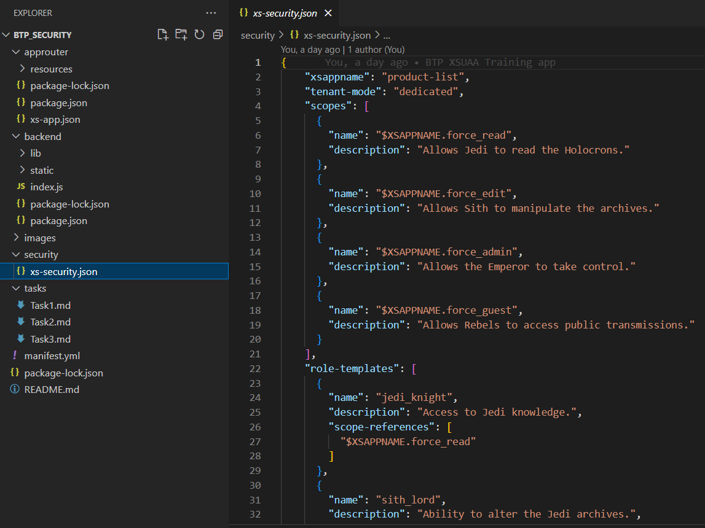
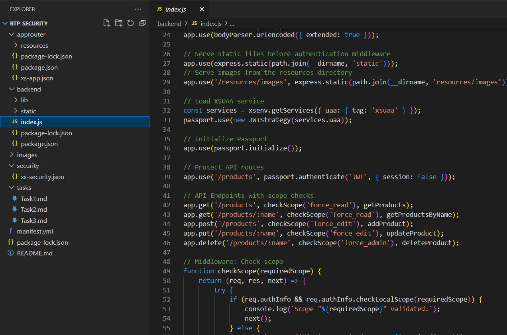

# Task 3: Update XSUAA Configuration for Role Management

In this task, you will learn how to update the XSUAA configuration by replacing the Star Wars-themed user roles with standard roles like Admin, Editor, Reader, and Guest. This transition involves modifying the `xs-security.json` file, adjusting your application code in `index.js`, and republishing the updated configuration to Cloud Foundry.

## Step-by-Step Guide

### Step 1: Modify `xs-security.json`

**Objective**: Transition to new standard user roles.

#### Instructions:

1. **Locate the File**: 
    - Navigate to `btp_security/security/xs-security.json` in your project directory via the BTP development environment.
    

2. **Update Scopes**:
    - Replace the existing Star Wars-themed scopes with the following:

    ```json
    "scopes": [
      {
        "name": "$XSAPPNAME.admin",
        "description": "Gives full admin rights."
      },
      {
        "name": "$XSAPPNAME.edit",
        "description": "Allows content editing."
      },
      {
        "name": "$XSAPPNAME.read",
        "description": "Permits viewing content."
      },
      {
        "name": "$XSAPPNAME.guest",
        "description": "Allows access to guest content."
      }
    ]
    ```

3. **Edit Role Templates**:
    - Change the existing Star Wars role templates to new roles. For example, transform:
    
    ```json
    "role-templates": [
      {
        "name": "jedi_knight",
        "description": "Access to Jedi knowledge.",
        "scope-references": [
          "$XSAPPNAME.force_read"
        ]
      },...
    ]
    ```
    - To:

    ```json
    "role-templates": [
      {
        "name": "reader",
        "description": "Readers can read hardware from the Database",
        "scope-references": [
          "$XSAPPNAME.read"
        ]
      },...
    ]
    ```
    -Your task is to do it also for the other elements in the role-templates array

4. **Edit Role Collections**:
    - Update role collections accordingly. For instance, change:

    ```json
    "role-collections": [
      {
        "name": "JediOrder",
        "description": "Members of the Jedi Order with reading privileges.",
        "role-template-references": [
          "$XSAPPNAME.jedi_knight"
        ]
      },...
    ]
    ```
    - To:

    ```json
    "role-collections": [
      {
        "name": "Reader",
        "description": "Members of the Reader Collections will have reading privileges.",
        "role-template-references": [
          "$XSAPPNAME.reader"
        ]
      },...
    ]
    ```
    -Your task is to do it also for the other elements in the role-collections array
    
### Step 2: Deploy Updated XSUAA Configuration

Deploy the updated `xs-security.json` configuration to your existing XSUAA service:

1. **Open Terminal**: 
   - Ensure you are in the `btp_security` directory.
   
2. **Update Service**:
   - Run the command: 
     ```bash
     cf update-service xsuaa-service-tutorial -c ./security/xs-security.json
     ```
   - Wait for a confirmation message indicating success or address any errors.

### Step 3: Adjust Code in `index.js`

**Objective**: Reflect new scopes in your application code.

#### Instructions:

1. **Verify Successful Update**: 
   - Ensure the XSUAA instance was updated correctly in Step 1.

2. **Update Middleware**:
   - Open `index.js` located in `btp_security/backend/`.
   
   
3. **Modify Scope Checks**:
   - Replace the Star Wars-themed scopes with new ones in your code: 
   - Open the `index.js` file and locate the following part:
```javascript
// API Endpoints with scope checks

app.get('/products', checkScope('force_read'), getProducts);
app.get('/products/:name', checkScope('force_read'), getProductsByName);
app.post('/products', checkScope('force_edit'), addProduct);
app.put('/products/:name', checkScope('force_edit'), updateProduct);
app.delete('/products/:name', checkScope('force_admin'), deleteProduct);
```
This code makes sure that the `/products` endpoint of the BTP application can only be accessed, if the corresponding scopes in the `checkScope()` function have been assigned to a user. Remember that you initially assigned yourself the `JediOrder` role collection that inherited the `jedi_knight` role template which then provided you the scope `$XSAPPNAME.force_read`. Since we updated `$XSAPPNAME.force_read` to `$XSAPPNAME.read`, we also need to reflect this in the code middleware. For this, update the existing code to:

```javascript
// API Endpoints with scope checks

app.get('/products', checkScope('read'), getProducts);
app.get('/products/:name', checkScope('read'), getProductsByName);
app.post('/products', checkScope('edit'), addProduct);
app.put('/products/:name', checkScope('edit'), updateProduct);
app.delete('/products/:name', checkScope('admin'), deleteProduct);
```

### Step 4: Republish the Application

**Objective**: Deploy the updated backend.

1. **Save Changes**:
   - Ensure all changes in `index.js` are saved.

2. **Deploy Application**:
   - Execute in the terminal within `btp_security`: 
     ```bash
     cf push product-list
     ```

### Step 5: Assign New Roles

1. **Assign Roles**:
   - Assign yourself the updated role collections like Admin, Editor, Reader, and Guest using the SAP BTP Cockpit, analogous to [Step 6](../Readme.md#step-6-assign-necessary-roles) from the initial deployment.

2. **Test Changes**: 
   - Access the frontend via `https://frontendGroupxx.cfapps.us10-001.hana.ondemand.com` and attempt to add or delete a hardware item, verifying the roles are correctly applied.


If you have updated the `xs-security.json` based on the new scopes and you are able to add and delete items from the hardware store, you can continue with [Task 4](./Task4.md)
