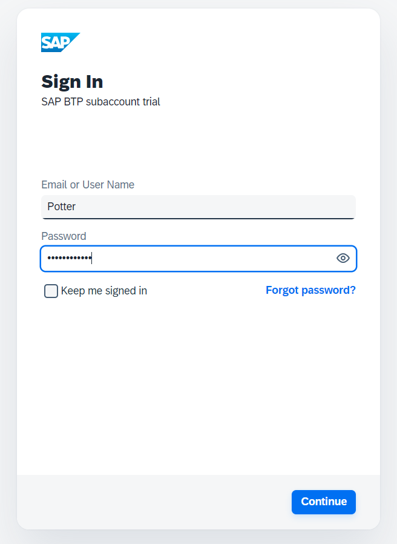

# Task 5: Deploying and Connecting a Custom Identity Provider (SAP CIS)

## Goal of Task 5

In this task, you will deploy the **SAP Cloud Identity Services (CIS)**, connect it to your SAP BTP Trial environment, and configure a new user in CIS. You will then use this new user to authenticate to the hardware store application. Finally, you will troubleshoot any permission issues using the insights from previous tasks.

---

## Steps

1. **Create a Cloud Identity Service (CIS) Instance**  
   - Log in to your SAP BTP Trial account.
   - Under **Service Marketplace**, search for **"Cloud Identity Service"**.
   - Click on the three dots next to the service and select **"Create"**.  
     

2. **Select the Plan**  
   - In the popup **"New Instance or Subscription"**, select the **"default"** plan and click **Create**.  
     

3. **View the Subscription**  
   - Click on **"View Subscription"**.  
     

4. **Wait for Subscription Activation**  
   - Wait until the **Cloud Identity Service** subscription status changes from **Processing** to **Subscribed**.  
     

5. **Activate Your Account**  
   - Once subscribed, you will receive an activation email sent to the email address used for your BTP Trial account.
   - Open the email and click the **"Click here to activate your account"** button.  
     
   - On the popup page, enter and confirm your password.

6. **Establish Trust with SAP BTP**  
   - Go back to your BTP Trial account.
   - Navigate to **Security > Trust Configuration**.
   - Click on **"Establish Trust"**.  
     

7. **Select the CIS Instance**  
   - In the popup **"Configure Tenant"**, select the newly created **CIS Instance** (it will be the only option listed) and click **Next**.  
     

8. **Select the Domain**  
   - In the dropdown, select the **"ondemand.com"** domain and click **Next**.  
     

9. **Keep Default Configuration**  
   - At the **Configure Parameters** step, keep everything as is and click **Next**.  
     

10. **Finish Trust Configuration**  
    - On the final **"Review"** step, click **Finish**.  
      

11. **Verify Trusted Identity Provider**  
    - You should now see the newly established trusted **Custom Identity Provider** in the list of trusted providers for applications.  
      

12. **Access the CIS Dashboard**  
    - Go back to the **CIS Dashboard** using the link from the activation email.
    - Click on **"User Management"**.  
      

13. **Add a New User**  
    - In the **User Management** dashboard, click on **"+Add"**.  
      

14. **Create a New User**  
    - Enter the new user’s details:
      - Use an email address that hasn’t been used before (e.g., a colleague’s email or a test email).
      - Select **"Set Initial Password"** and enter a password following the configured rules.
      - Click **+Add**.  
        

15. **Verify the New User**  
    - The new user should now appear in the **User Management** list.  
      

16. **Authenticate Using the New Identity Provider**  
    - Visit the **frontend of the hardware store** application.
    - In the authentication window, select the newly created **Custom Identity Provider** (not the default provider).  
      

17. **Login as the New User**  
    - Enter the username and password created in **Step 14**.  
      

18. **Troubleshoot Permission Issues**  
    - You will likely see a **Forbidden** message after logging in. 
    - **Can you solve this issue?**
      - **Hint**: Refer to **Task 1** for assigning the correct roles and scopes to the user in the BTP Cockpit.
        - Ensure the user has the correct **Role Collection** (e.g., `JediOrder`, `SithEmpire`, etc.) to access the hardware store.
      
      

---

## Task Summary

1. Deploy the **Cloud Identity Service (CIS)** in the SAP BTP Trial environment.
2. Connect CIS as a trusted identity provider in your BTP account.
3. Create a new user in the CIS dashboard.
4. Use the new user to authenticate to the hardware store application.
5. Troubleshoot permission issues by assigning the correct scopes and roles.

---

